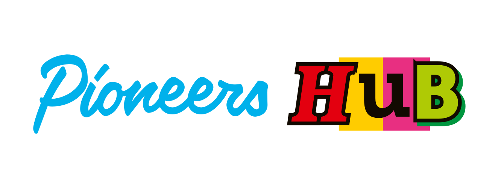

# :fontawesome-solid-book-atlas: About PyCon DE & PyData 2025

## 🚨 This is the Public Documentation for PyCon DE & PyData 2025, not the Website!

!!! info
    After some awesome years in Berlin, it was time to move on.  
    **The conference will take place 23. - 25. April in Darmstadt, Germany.**

We like to share our documentation with the public to show how we work and to inspire others to do the same.
In case you are looking for the conference website to attend or speak  please visit [pycon.de](https://pycon.de).

## 🤝 A Joint Conference

PyCon DE & PyData 2025 brings together Python communitie,s in a unique collaboration.
From programming, software development, and data science to machine learning and artificial intelligence to MLOps,
Community, ethics, our conference covers a wide range of topics.

This joint conference is organized by:

- **[Python Software Verband e.V.](https://www.python-verband.org/){:target="blank"}** - The German Python Software Association
- **[NumFOCUS Inc.](https://numfocus.org/){:target="blank"}** - Supporting scientific computing and data science
- **[Pioneers Hub gGmbH](https://www.pioneershub.org/en/){:target="blank"}** - Non-profit fostering innovation and community building

## 🎯 Our Vision

We're creating a space where Python's diverse community comes together to learn, share, and grow. Whether you're using Python to build web applications, analyze data, develop AI solutions, or automate business processes, this conference is for you. We unite:

- Industry Professionals: Engineers, developers, and data scientists using Python in production
- Researchers: Academic and industry researchers advancing the field
- Data Practitioners: Analysts and data experts working with PyData tools daily
- Developers: Software engineers building with Python
- Community Members: Enthusiasts, educators, and open-source contributors
- Decision Makers: Technical leaders and managers exploring Python solutions

## 🌟 What Makes Us Special

- **Diverse Content**: From web development to data science, from AI to IoT
- **Dual Tracks**: Dedicated tracks for both PyCon and PyData content
- **Community-Driven**: Organized by volunteers who are passionate about Python
- **Inclusive Environment**: Committed to diversity and accessibility
- **Knowledge Exchange**: Mix of talks, tutorials, and workshops
- **Networking**: Abundant opportunities to connect with peers and experts
- **Newcomers & Beginners**: Welcoming environment for all skill levels

## 💡 Program Highlights

- Technical talks and tutorials across all skill levels
- Hands-on workshops and coding sessions
- Keynote speeches from thought leaders
- Lightning talks for quick knowledge sharing
- Sponsor exhibitions and job opportunities
- Social events and networking sessions

## 🤲 Community Values

- **Open Source**: Supporting and promoting open source development
- **Diversity**: Actively working to include underrepresented groups
- **Education**: Fostering learning and skill development
- **Collaboration**: Encouraging community participation
- **Innovation**: Showcasing new ideas and technologies

## 🎫 Accessibility

We strive to make our conference accessible to everyone:

- Financial aid program for those who need it
- Childcare services during the conference
- Accessible venue facilities
- Live captioning for talks
- Hybrid format with online participation options

## 🌍 Environmental Responsibility

We're committed to reducing our environmental impact:

- Digital-first approach to materials
- Encouraging sustainable travel options
- Working with eco-conscious suppliers
- Minimizing conference waste

## 🤝 Get Involved

There are many ways to participate:

- Volunteer during the conference
- Sponsor the event
- Submit a talk or tutorial proposal
- Join as an attendee
- Spread the word in your community

## 🏠 Our Roof Organizations

**Python Software Verband e.V.**  
The German Python Software Association promotes Python programming language and its ecosystem in German-speaking regions
through education, events, and community building.
Website: [Python Software Verband e.V.](https://www.python-verband.org/)

**NumFOCUS Inc.**  
A nonprofit supporting innovative open-source scientific computing projects, including numpy, pandas, matplotlib, and
many other core tools in the Python scientific stack.
Website: [NumFOCUS](https://numfocus.org/)

**Pioneers Hub gGmbH**  
A non-profit organization dedicated to building and supporting communities of experts in technology and research,
fostering knowledge sharing and innovation.
Website: [Pioneers Hub](https://www.pioneershub.org/en/)

---

Join us in making PyCon DE & PyData 2025 an unforgettable experience for the Python community!

--- 
## A Big Thank You

It is based on the experience of running and co-organizing events like [PyCon DE](https://de.pycon.org/),
[EuroPython](https://europython.eu), [EuroSciPy](https://euroscipy.org) and [PyData Berlin](https://berlin.pydata.org).

This playbook wouldn't exist without the hard work and dedication of countless volunteers who've organized conferences
over the years. Their experiences and insights have been invaluable in creating this resource.

❤️ We're grateful to everyone who has contributed to making these events better year after year.

## Attribution

This plyabook draws on years of experience from organizing of running and co-organizing events since like
[PyCon DE](https://de.pycon.org/)
and [PyData Berlin](https://berlin.pydata.org), [EuroPython](https://europython.eu), [EuroSciPy](https://euroscipy.org)

These awesome people have contributed to content this documentation was built upon:

[Aeneas Christodoulou](https://github.com/AeneasChristodoulou): Video;
[Alexander CS Hendorf](https://github.com/alanderex): Program, Steering, Office;
[Alina Lenhardt](https://github.com/alina-lenhardt): Program, Communication;
[Anastasia](https://github.com/asamokhina): Communication;
[Anja Pilz](https://github.com/aplz): Program;
[Christopher Schultz](#): Program;
[Daniel Ringler](https://github.com/dringler): Infrastructure, Steering;
[Florian Wilhelm](https://github.com/florianwilhelm): Program;
[Julio Batista Silva](https://github.com/jbsilva): Diversity;
[Jurik Sommer](https://github.com/Jurik-001): Program;
[Kristian Rother](https://github.com/krother): On-Site;
[Lisa Andreevna Chalaguine](#): Program;
[Marisa Mohr](https://github.com/marisamohr): Program;
[Maryam Pourranjbar Mohr](#): Program;
[Matthias Hofmann](#): Program;
[Mihail Douhaniaris](https://github.com/mtdo): Video;
[Mojdeh Rastgoo](https://github.com/mrastgoo): Diversity;
[Naa Ashiorkor Nortey](https://github.com/7ashiorkor7): Diversity;
[Nils Finke](https://github.com/FinkeNils): Program;
[Nydia Medina](https://github.com/nydiamedina): Diversity;
[Olakunle Olaniyi](https://github.com/rugging24): Communication;
[Paula González Avalos](https://github.com/pga99): Diversity;
[Ricardo Kawase](#): Program;
[Sabine Reisser](https://github.com/orgs/PYCONDE/people/sreisser): Video;
[Sebastian Neubauer Reisser](https://github.com/sebastianneubauer): Video, Steering;
[Shivam Singhal](https://github.com/championshuttler): On-Site;
[Theodore Meynard](https://github.com/orgs/PYCONDE/people/terezaif): Diversity, Swag;
[Valentina Scipione](https://github.com/astrovale): On-Site;

We missed mentioning you?   
We value all contributions to this project, including those made in the past. If you have contributed to
community-driven conferences or this playbook in the past and would like to be acknowledged:

1. Open a pull request titled "Add [Your Name] to Contributors".
2. In the pull request description, briefly describe your contribution. For example:
    - "I helped organize 2022 in program"
    - "I contributed the section on volunteer management of this playbook"

We'll review your pull request and merge it if appropriate.

## Who We Are

This playbook is maintained by [Pioneers Hub](https://www.pioneershub.org/en/), an organization dedicated to building
and nurturing communities of experts in tech and research. Our goal is to facilitate knowledge sharing, collaboration,
and innovation.

{ style="width:50%" }

Together, let's create conferences that inspire, educate, and bring people together!